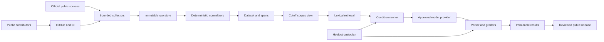

# Threat model

Status: Phase 2 controls verified; later-phase gaps retained explicitly
Last updated: 2026-07-19

## Executive summary

The highest risks are benchmark-integrity failures rather than compromise of a
hosted service: hostile or stale source material influencing model behavior,
post-cutoff data entering an earlier corpus view, sealed holdout or provider
traces reaching the eventual public repository, and source or dependency
changes invalidating reproducibility. The project is a local CLI/library with
bounded collection and separately approved provider egress, but its GitHub
repository and CI are intended to become public. Accordingly, tracked files,
logs, fixtures, and prediction manifests must be safe for public disclosure by
default.

## Scope and assumptions

In scope:

- repository controls, implemented Python CLI/library, bounded source collectors,
  normalizers, snapshot store, dataset builder, lexical retriever, provider
  adapter, graders, experiment ledger, CI, and release artifacts;
- public NVD, CISA KEV, MITRE ATT&CK, and selected Red Hat RHSA CSAF inputs;
- local model-provider credentials used only for separately approved runs;
- encrypted two-stage holdout handling and eventual public GitHub/CI surfaces.

Evidence anchors: `AGENTS.md`, `.codex/EXECUTION_PLAN.md` sections 4–16,
`.gitignore`, `docs/provider-safety-protocol.md`, and
`reports/evaluation-brief.md`.

Assumptions confirmed or adopted:

- the benchmark remains a local single-operator CLI/library, not a hosted or
  multi-tenant service;
- the GitHub repository is intended to become public-facing, but stays private
  until the release-safety gate passes;
- runtime evidence is public CTI or synthetic; private customer and production
  CTI are out of scope;
- collection and explicitly approved provider transport may use network;
  historical evaluation and holdout grading are offline;
- ordinary CI has no paid-provider credentials and never decrypts holdout data;
- public contributors may propose changes, but maintainers control review,
  branch protection, secrets, release, and merge decisions.

Out of scope:

- live target scanning, exploitation, malware, credential collection, arbitrary
  crawling, production analyst workflows, hosted endpoints, and public release
  before the release gate;
- security of NVD, CISA, MITRE, Red Hat, GitHub, or model-provider
  infrastructure themselves.

Open questions that can change ranking:

- exact GitHub branch-protection and Actions permissions once the repository is
  public;
- whether a future manual CI workflow will ever receive provider secrets.

The user chose a manager-custodian model rather than a separate human
custodian. This reduces organizational independence; mechanical two-key,
two-stage isolation and frozen-development rules must carry the boundary.

## System model

### Primary components

- **Collector boundary:** bounded HTTP/Git retrieval of approved official
  sources into immutable raw blobs and manifests
  (`.codex/EXECUTION_PLAN.md` sections 3, 5, and 10 Phase 3).
- **Normalization boundary:** deterministic parsing into versioned documents
  and reversible evidence spans (sections 4–6).
- **Dataset boundary:** case, gold, authority, adversarial-pair, split, and
  encrypted holdout construction (sections 6–7).
- **Evaluation boundary:** cutoff-filtered corpus view, lexical retrieval,
  condition runner, optional approved provider transport, deterministic grading,
  and immutable ledgers (sections 8–13).
- **Development/release boundary:** public GitHub, credential-free CI,
  dependency lock, review, checksums, and release artifacts (sections 13–16).

Phase 2 now implements and tests snapshot hashing/admissibility, bounded
NVD/CISA KEV/Red Hat ingestion and normalization, exact-span grading, lexical
retrieval, provider preflight/ledger/recovery controls, and credential-free CI.
The new provider-free candidate audit checks split leakage, paired-treatment
isolation, and prospective coverage. These controls are smoke-tested only:
the corpus remains one-entity Log4Shell plumbing, validation and ATT&CK
real-source cases are absent, and holdout/release machinery is not implemented.

### Data flows and trust boundaries

- Official public source → collector: JSON, STIX, CSAF, metadata, redirects,
  signatures, and hashes cross HTTPS/Git. Publisher identity, bounded source
  allowlists, rate limits, schema checks, and content hashes are required.
- Collector → raw store: untrusted bytes cross into a content-addressed local
  area. Append-only naming, byte hashes, response-metadata allowlists, and
  overwrite rejection are required.
- Raw store → normalizer: attacker- or publisher-controlled text and structured
  fields cross a parser boundary. Active content is data only; executable
  content, source instructions, and dynamic evaluation are prohibited.
- Normalizer → dataset/retriever: versioned text, spans, source metadata, and
  availability facts cross into integrity-critical benchmark state. Schema,
  round-trip locators, authority policy, and cutoff derivation are required.
- Cutoff corpus → provider: selected public/synthetic spans, questions,
  evidence IDs, and authorization envelope cross the only permitted model
  egress. A separately approved run, allowlisted context, exact cost
  reservation, and provider-safety preflight are required.
- Provider → parser/grader: untrusted structured output and safety status cross
  back into local evaluation. No tool authority, semantic retry, or
  self-grading is allowed.
- Holdout custodian → prediction/grading stages: separately encrypted inputs and
  gold cross two different release points. Keys and plaintext remain outside
  the repository and OneDrive; only non-sensitive hashes/manifests may be
  tracked.
- Developer/contributor → GitHub/CI: code, docs, fixtures, dependency changes,
  and workflow edits cross a public contribution boundary. Review, branch
  protection, offline CI, secret scanning, and artifact allowlists are required.
- Local results → public release: reports, manifests, checksums, permitted
  fixtures, and redacted bundles cross a disclosure/license boundary. Release
  review and source-specific terms decide inclusion.

#### Diagram

## Assets and security objectives

| Asset | Why it matters | Security objective |
|---|---|---|
| Raw snapshots and manifests | establish exactly what evidence existed and was evaluated | Integrity, availability |
| Availability/cutoff decisions | a single later-data admission can invalidate historical results | Integrity |
| Normalized text and span maps | citations and human audits depend on stable exact locators | Integrity |
| Gold claims and authority policy | define benchmark truth and conflict behavior | Integrity, limited confidentiality before freeze |
| Holdout inputs, gold, and keys | premature access enables tuning and invalidates the primary result | Confidentiality, integrity |
| Predictions and run ledger | preserve denominators, failures, schedule, and immutable outcomes | Integrity, availability |
| Provider/API credentials | disclosure enables cost or account abuse | Confidentiality |
| Unredacted provider traces | may contain request metadata or disallowed source content | Confidentiality |
| Public source licenses/notices | omission can make release noncompliant or misleading | Integrity, availability |
| Source, workflows, lock file, release checksums | supply-chain changes can alter results or published artifacts | Integrity |
| Public project reputation | overstated or irreproducible claims undermine research value | Integrity |

## Attacker model

### Capabilities

- publish or alter a source document, metadata field, redirect, or linked
  content later fetched by the collector;
- place prompt-like instructions, stale claims, wrong-entity content, hidden
  HTML, malformed JSON, extreme sizes, or contradictory facts in source data;
- submit a public pull request changing code, dependencies, fixtures, prompts,
  workflows, or reports;
- observe every tracked file, public CI log, artifact, issue, release, and Git
  history after visibility changes;
- trigger ordinary public CI within configured GitHub permissions;
- cause upstream timeout, rate-limit, partial response, removal, or mutable
  latest-version behavior;
- return malformed, refused, safety-checked, or semantically unsupported model
  output from an external provider.

### Non-capabilities

- no assumed access to maintainer accounts, local secret storage, holdout
  identities, protected branches, or user-controlled plaintext paths;
- no hosted application endpoint, multi-tenant database, or production network
  target exists in scope;
- source text, pull requests, model output, and subagent reports cannot authorize
  a merge, paid call, visibility change, release, or key use;
- attacks requiring live exploitation or operational payloads are outside the
  benchmark and provider request envelope.

## Entry points and attack surfaces

| Surface | How reached | Trust boundary | Notes | Evidence |
|---|---|---|---|---|
| Approved source URL | bounded HTTPS/Git fetch | Internet → collector | untrusted bytes and metadata; no broad crawl | `.codex/EXECUTION_PLAN.md` sections 3, 5, 10 |
| Raw parser/normalizer | fetched JSON, STIX, CSAF, HTML fixture | raw store → Python parser | never execute source code or source instructions | `AGENTS.md` Untrusted-Content Boundary |
| CLI file/config arguments | local operator or CI invokes the CLI | operator/CI → runtime | rejects invalid input paths, schemas, and configs; later holdout/release commands remain absent | `.codex/EXECUTION_PLAN.md` sections 5, 10, 13 |
| Provider request | separately approved command | local runner → provider | public/synthetic allowlist only; exact cost cap | `docs/provider-safety-protocol.md` sections 1–5 |
| Provider response | external model result | provider → parser/grader | untrusted data; no semantic repair or tool authority | `reports/evaluation-brief.md` Required conditions |
| Holdout bundles/keys | manager-controlled staged release | custodian → isolated runner | two keys, two stages, external temporary path; no subagent key access | `.codex/EXECUTION_PLAN.md` section 7 |
| Git pull request | public contributor | Internet → GitHub/CI | workflow and dependency changes are security-sensitive | `.codex/EXECUTION_PLAN.md` sections 13, 15 |
| CI logs/artifacts | public workflow execution | CI → public viewers | must contain no secrets, holdout, restricted sources, or raw traces | `.gitignore`; `AGENTS.md` GitHub discipline |
| Release packaging | maintainer command | local artifacts → public release | license and disclosure allowlist required | `.codex/EXECUTION_PLAN.md` sections 13–14 |
| OneDrive-backed worktree | local sync | workstation → cloud sync | plaintext holdout and identities prohibited | `.codex/EXECUTION_PLAN.md` holdout protocol |

## Top abuse paths

1. A source embeds instruction-like text → normalizer mixes it into ordinary
   prompt instructions → model follows it → attack result is mistaken for a
   supported CTI answer.
2. A later corrected snapshot remains in the physical index → cutoff filtering
   selects it or duplicates entity versions → an earlier answer uses later
   knowledge → temporal conclusions are invalid.
3. A public contributor changes an availability algorithm or gold fixture →
   weak review accepts the change → CI remains superficially green → benchmark
   truth silently shifts.
4. A provider key or unredacted request ID enters a log/fixture → repository or
   CI becomes public → third parties obtain credentials or private account
   metadata.
5. Holdout inputs or predictions are committed instead of only opaque hashes →
   public Git history preserves them → later tuning or inference invalidates
   the sealed result.
6. A collector follows a mutable URL or partial response → raw bytes overwrite
   or masquerade as an old snapshot → normalized evidence cannot be reproduced.
7. A malformed or oversized source/archive consumes memory, disk, or parser
   time → collection is interrupted → a partial artifact is treated as
   complete or CI availability degrades.
8. A source license or linked-content boundary is misunderstood → restricted
   raw material is included in a public fixture/release → the release must be
   withdrawn or cannot be reproduced lawfully.
9. Provider refusal, timeout, or parse failure is silently retried or dropped →
   denominators and condition schedules diverge → treatment effects are biased.

## Threat model table

| Threat ID | Threat source | Prerequisites | Threat action | Impact | Impacted assets | Existing controls (evidence) | Gaps | Recommended mitigations | Detection ideas | Likelihood | Impact severity | Priority |
|---|---|---|---|---|---|---|---|---|---|---|---|---|
| TM-001 | hostile or compromised source | approved source contains instruction-bearing or misleading text | source content changes model behavior or benchmark labels | biased answers, unsafe provider content, invalid attack metric | normalized text, prompts, results | untrusted-source policy, field-specific normalizers, structured provider packets, exact evidence grading, and one synthetic contradiction/instruction pair are tested | one confounded pair cannot estimate attack success or generalize across source/injection families | add isolated clean/attacked pairs, forbidden-outcome grading, and per-family attack-success denominators | record selected spans/context hashes and attack outcomes | High | High | High |
| TM-002 | mutable source, builder bug, contributor | multiple versions exist around a cutoff | admit later or duplicate source state | invalid point-in-time result | manifests, corpus view, gold, results | tested fail-closed admissibility, latest-valid-state selection, post-cutoff exclusion, corpus hashing, and cross-split lineage/content audits | tracked candidate has one observed state per real entity/template and no validation split | add real changed-state cases, freeze dev/validation manifests, and run leakage audit before every candidate freeze | log corpus-view hash and excluded versions per case | High | High | High |
| TM-003 | accidental developer/CI disclosure | secret or trace reaches tracked/logged content before public visibility | publish provider/API key, account metadata, or raw trace | credential abuse, cost, privacy incident | credentials, traces, reputation | `.gitignore`, tested value redaction, redacted provider ledgers, candidate-tree secret scanner, and credential-free Ubuntu/Windows CI | public-host GitHub secret scanning and release-archive inventory are not yet verified | retain scanner in CI/pre-push; add release-archive allowlist and verify host controls before visibility change | GitHub secret scanning and CI artifact inventory | Medium | High | High |
| TM-004 | process error or malicious contributor | holdout projection, path, or checkpoint rule is wrong | expose inputs, gold, keys, or identifying predictions | primary benchmark invalidation | holdout, predictions, reputation | manager-custodian two-key/two-stage protocol; hash-only Git policy (`reports/evaluation-brief.md`) | no independent human custodian; tools unimplemented | separate age identities, external non-synced paths, frozen-development rule, synthetic premature-access tests, hash-only commit | audit bundle/key access, prediction hash, cleanup result | Medium | High | High |
| TM-005 | public contributor or compromised dependency | public PR/workflow can run or alter build | modify graders, prompts, dependencies, or artifacts without adequate review | supply-chain compromise or silent methodology drift | code, lock, graders, release | dependencies are locked; credential-free Ubuntu/Windows CI uses read-only permissions and commit-pinned actions | public branch protections, SBOM, signing, and release workflow are not configured | protected main, required reviews, least-privilege Actions, lock diff review, dependency audit, reproducible release checksum | review workflow/permission diffs and dependency alerts | Medium | High | High |
| TM-006 | mutable/ambiguous upstream source | current body or timestamp is treated as historical proof | backdate exact bytes or erase superseded claim | false temporal ground truth | source manifests, gold | tested NVD observed-snapshot, pinned CISA KEV lineage, and checksum-verified Red Hat adapters; truth modes are explicit | no real ATT&CK adapter/case; Red Hat timing is publisher-declared version evidence and cannot establish earlier byte availability | add ATT&CK capture semantics and changed-state inventories; preserve Red Hat limitation and append-only versions | compare manifest chronology and upstream version metadata | High | High | High |
| TM-007 | release process error | source terms or third-party links are incompletely modeled | publish non-redistributable content or omit attribution | takedown, unusable release, misleading provenance | fixtures, release, reputation | source-specific conservative release matrix (`reports/evaluation-brief.md`) | release allowlist tooling absent | artifact license manifest, linked-content exclusion, hash/fetch fallback, manual release review | scan archive against source/license manifest | Medium | Medium | Medium |
| TM-008 | malformed/oversized upstream bytes | collector or parser lacks bounds | exhaust disk/memory/time or accept partial archive | interrupted collection, corrupt snapshot, CI DoS | availability, raw store, manifests | tested byte caps, timeouts, bounded retry/delay, streaming reads/hashes, atomic materialization, and interrupted-session recovery | archive/decompression-ratio handling and broad multi-source recovery are not implemented | retain size/time limits; add archive ratio caps and cursor checkpoints only if future approved sources require archives | metrics for bytes, time, retries, partial cleanup | Medium | Medium | Medium |
| TM-009 | provider or harness failure | failures are retried/dropped inconsistently | alter condition order or denominator | biased effect estimates and hidden safety behavior | schedule, ledger, results | tested immutable schedule, per-attempt reservation/terminal/safety ledgers, exact-request retry hash, fail-closed locks/resume, and a reconciled 12-slot canary | the remaining 96 slots are unauthorized; the earlier `$6` full-run ceiling is incompatible with retry reservations | freeze a representative pilot schedule and retry-inclusive ceiling only after corpus/calibration gates; obtain new exact approval | compare planned vs realized calls and safety-event counts | Medium | High | High |
| TM-010 | operator/contributor path abuse | CLI accepts arbitrary paths or archives | read unintended local files or overwrite immutable artifacts | local data exposure or benchmark corruption | workstation data, snapshots | tested repository-root containment, symlink/junction rejection, immutable blob writes, provider-root isolation, and safe manifest inputs | operator-selected report outputs remain writable; holdout mounts/projections do not exist | keep input allowlists and exclusive artifact creation; add read-only holdout mounts and projection tests before holdout work | log redacted resolved roots and overwrite rejections | Low | High | Medium |

## Criticality calibration

- **Critical:** direct exposure of holdout gold before prediction freeze;
  automatic execution of source-provided code with workstation/provider
  credentials; or public release of live credentials with confirmed abuse.
  None is currently evidenced.
- **High:** post-cutoff leakage that invalidates the primary result; public
  disclosure of holdout inputs/predictions; persistent benchmark truth change
  through a malicious dependency/workflow or gold edit.
- **Medium:** bounded local denial of service with recoverable artifacts;
  redistributable-content mistake caught before release; path misuse requiring a
  local operator to supply a malicious input.
- **Low:** public disclosure of already public, non-sensitive metadata without
  methodological effect; noisy transient source failures correctly recorded;
  cosmetic documentation changes outside frozen research claims.

Rankings assume no hosted service and no CI provider secrets. Hosting,
multi-tenancy, private CTI, or secret-enabled public pull-request workflows
would raise several likelihoods and impacts.

## Focus paths for security review

| Path | Why it matters | Related Threat IDs |
|---|---|---|
| `AGENTS.md` | root authority for source, holdout, GitHub, and side-effect boundaries | TM-003, TM-004, TM-005 |
| `.codex/EXECUTION_PLAN.md` | canonical temporal, split, recovery, and release contract | TM-002, TM-004, TM-006, TM-009 |
| `docs/provider-safety-protocol.md` | provider egress, authorization, refusal, and redaction contract | TM-001, TM-003, TM-009 |
| `reports/evaluation-brief.md` | frozen treatment, estimand, claim-grade, temporal, and holdout decisions | TM-002, TM-004, TM-006, TM-009 |
| `.gitignore` | first-line exclusion of secrets, raw data, holdout keys, and traces | TM-003, TM-004 |
| `src/cti_provenance/ingest/` | implemented untrusted network, bounded retry, and partial-download boundary | TM-001, TM-006, TM-008 |
| `src/cti_provenance/snapshot/` | implemented immutability, hashing, availability, and state selection | TM-002, TM-006, TM-010 |
| `src/cti_provenance/normalize/` | implemented source-specific parser and exact-span boundary | TM-001, TM-008 |
| `src/cti_provenance/dataset/` | implemented case and candidate audits; split sealing and holdout projections remain absent | TM-004, TM-005 |
| `src/cti_provenance/models/` | implemented credential, request-envelope, cost, and provider boundary | TM-001, TM-003, TM-009 |
| `src/cti_provenance/experiments/` | implemented Phase 2 schedule, retries, ledgers, replay, and readiness reporting | TM-009 |
| `src/cti_provenance/grading/` | implemented exact claim, evidence, temporal, authority, and abstention grading | TM-002, TM-005, TM-009 |
| `.github/workflows/` | credential-free private CI; future public-host settings remain a gate | TM-003, TM-004, TM-005 |
| `scripts/verify_release.py` | implemented candidate-tree credential scan; full release/license gate remains absent | TM-003, TM-004, TM-007 |

## Quality check

- [x] Current and planned entry points are covered.
- [x] Every identified trust boundary appears in at least one abuse path and
      threat.
- [x] Local runtime, collection/provider egress, public CI, and release are
      separated.
- [x] The user’s public-facing GitHub clarification is reflected.
- [x] Planned controls are not misrepresented as implemented.
- [x] Assumptions and the remaining holdout/CI questions are explicit.
